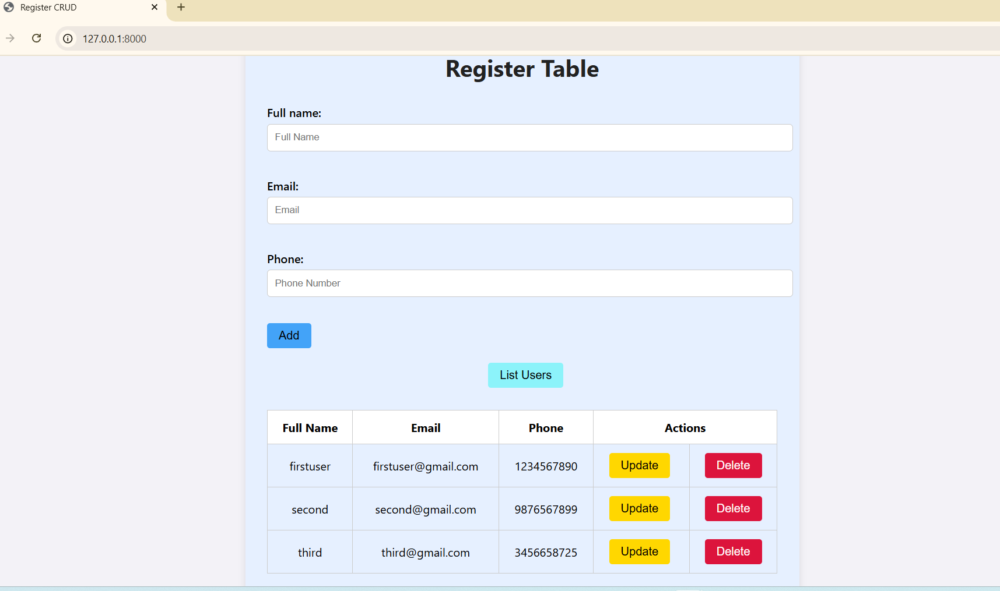

# Django Register Table CRUD Application
This project is a Django-based web application that implements **CRUD operations (Create, Read, Update, Delete)** on a Register table. It allows users to input their **Full Name, Email, and Phone Number**, and manage the data on a single page.

# Preview


# Features
- Create new registrations (name, email, phone)
- View all registered users
- Update user details
- Delete user entries
- Simple and clean UI with styling

# Tech Stack
- **Backend**: Python, Django
- **Frontend**: HTML, CSS
- **Database**: SQLite (default with Django)

# Setup Instructions
Follow these steps to run this project on your local machine:

# 1.Clone the Repository
```bash
git clone https://github.com/Vaishnavi-Iyengar/django-register-crud.git
cd django-register-crud

# django-register-crud
A Django project to manage user registration with full CRUD functionality.

